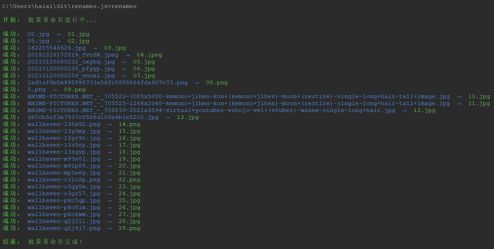
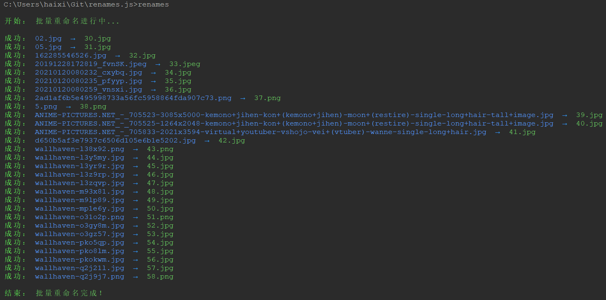
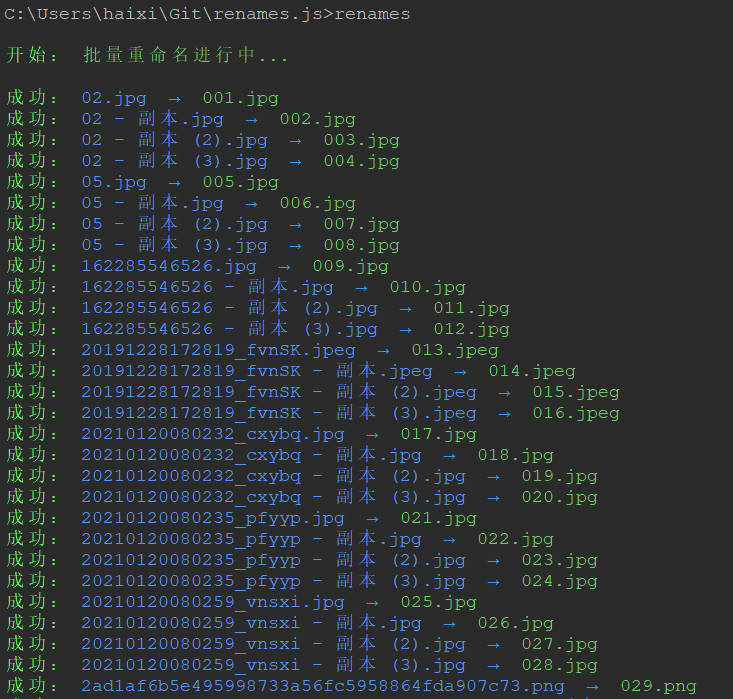
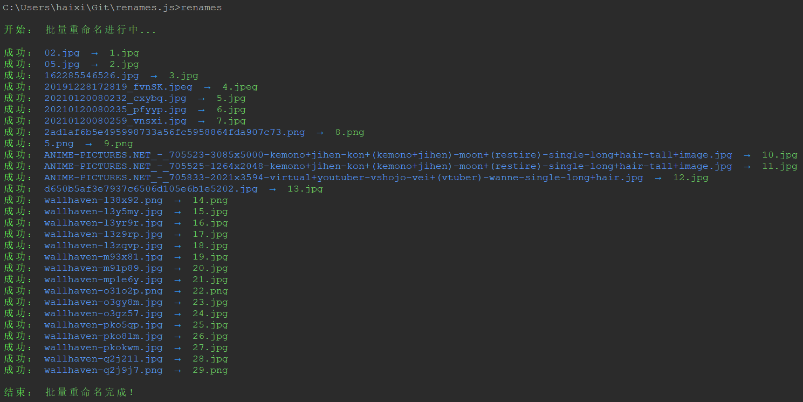
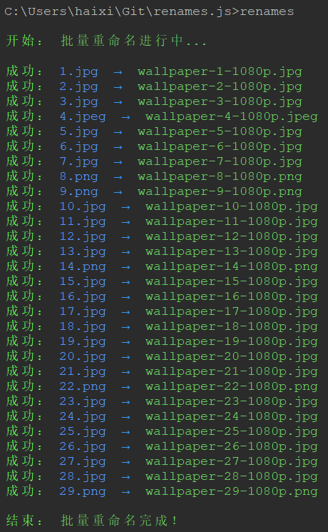
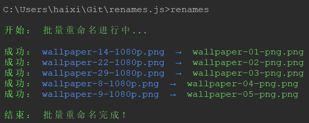
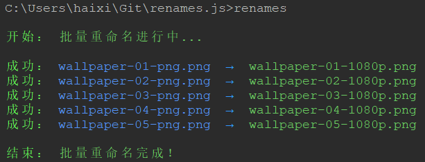
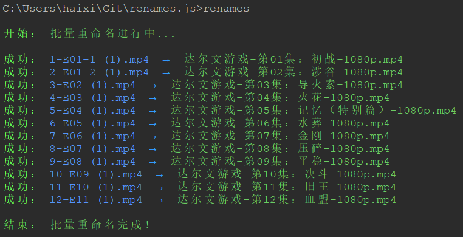

# renames.js

renames.js - 基于 Node 的批量文件名重命名 cli 工具库。

## Features

- 方便快捷，配置灵活；
- 支持指定文件名列表数据或者文件名列表文件；
- 支持文件名自动生成索引；
- 支持文件名自定义过滤；
- 支持文件名自定义排序；
- 支持文件名自定义格式化；

## Usage

首先需要全局安装 renames.js，命令如下：

```bash
npm i -g @yaohaixiao/renames.js
```

全局安装完成后，我们就可以在命令行使用了，renames.js 使用方式如下：

```bash
renames [arguments|command] [options]
```

renames.js 和其它 cli 工具一样，也可以通过 -h 选项获取完整帮助信息，命令如下：

```bash
renames -h
```

renames.js 提供目前提供一个 arguments（dir-path）参数和一个 command（init）子命令，以及10多个 options 配置信息。

### Arguments:

- dir-path - 可选，目标文件夹（绝对或相对）路径，如不设置，则使用 renames.config.js 中的 dirPath。

使用 dir-path 参数的命令如下：

```bash
renames C:\Downloads --autoIndex only
```

当然，我们可以指定更多的 options 配置选项指定具体的文件重命名的操作细节信息。

### Options

renames.js 提供了较为丰富的 options 参数，用以控制重命名的操作细节处理方式：

| 参数名                           | 参数说明                                                                                                        |
| -------------------------------- | --------------------------------------------------------------------------------------------------------------- |
| -h, --help                       | display help for command                                                                                        |
| --dir, --dirPath <dirPath>       | 可选，目标文件夹（绝对或相对）路径（注意：仅 init 命令支持）                                                    |
| --names, --namesList <namesList> | 可选，文件名列表数组数据，例如："新的开始,完美结局"。或者文件名列表文件的路径，例如："C:\Downloads\names.txt"。 |
| --prefix <prefix>                | 可选，文件名的前缀字符串，例如："动画片-第01话：新的开始-1080p.mp4"中的"动画片"                                 |
| --suffix <suffix>                | 可选，文件名的后缀字符串，例如："动画片-第01话：新的开始-1080p.mp4"中的"1080p"                                  |
| --connector <connector>          | 可选，文件名的前/后缀字符串间的连接字符串，例如："动画片-第01话：新的开始-1080p.mp4"中的"-"                     |
| --autoIndex [enable]             | 可选，是否自动生成索引编号（default：false）                                                                    |
| --startIndex <startIndex>        | 可选，索引编号起始值（default：0）                                                                              |
| --indexPadZero [enable]          | 可选，是否自动用"0"填充索引编号（default：true）                                                                |
| --indexPrefix <indexPrefix>      | 可选，索引编号的前缀字符串，例如："第01话：新的开始.mp4"中的"第" (default: "第")                                |
| --indexSuffix <indexSuffix>      | 可选，索引编号的后缀字符串，例如："第01话：新的开始.mp4"中的"话" (default: "集")                                |
| --delimiter <delimiter>          | 可选，索引编号和的前/后缀字符串间的连接符，例如："第01话：新的开始.mp4"中的"：" (default: "：")                 |
| -f, --force [enable]             | 可选，是否强制重命名（default：false）                                                                          |
| --ext, --extname <extname>       | 可选，重命名后的扩展名，例如：".txt"                                                                            |
| --sort, --sortBy <sortBy>        | 可选，排序类型，可选项：name、type、size、birthtime 和 modify-time (default: "name")                            |
| --order <order>                  | 可选，排序方式，可选项：desc 和 asc (default: "asc")                                                            |
| --sensitivity <sensitivity>      | 可选，排序方式为 name 时，大小写/重音处理的方式，可选项：base、accent、case 和 variant (default: "base")        |

例如希望将 C:\Downloads 目录下的文件批量重命名为数字索引的信息，可以输入以下命令：

```bash
renames C:\Downloads --autoIndex only
```

### Command

renames.js 目前仅提供了一个 init 子命令。

#### init 子命令

init 子命令是用来创建名为 renames.config.js 配置文件的，命令如下：

```bash
renames init
```

输入以上命令，renames.js 会提示输入 dirPath 和 namesList 两个重要的配置参数。

#### 获取 init 子命令的帮助信息

当然，renames.js 也可以直接在 init 命令后添加各种不同的 options 参数。查看完整的 options 参数信息的命令如下：

```bash
renames init -h
```

#### init 命令传递 options 配置参数

以下展示通过传递 options 参数中的 dirPath 和 namesList 信息生成配置文件的方法，命令如下：

```bash
renames init --dir C:\Downloads --names C:\Downloads\names.txt
```

以上命令的功能是将 C:\Downloads 文件夹下的文件名，已 names.txt 文件中的文件列表数据进行重命名。

## renames.config.js 配置文件

通过 init 命令生成 renames.config.js 文件的内容如下：

```js
export default {
  dirPath: 'C:\\Downloads',
  namesList: 'C:\\Downloads\\names.txt',
  prefix: '',
  suffix: '',
  connector: '',
  autoIndex: false,
  startIndex: 0,
  indexPadZero: true,
  indexPrefix: '第',
  indexSuffix: '集',
  delimiter: '：',
  force: false,
  extname: '',
  // 指定过滤 dirPath 文件夹中的文件过滤方法
  filter: null,
  // 可以是排序方式的名称（可选项：name、type、size、birthtime 和 modify-time），也可以是具体的处理函数
  sortBy: 'name',
  order: 'desc',
  sensitivity: 'base',
  // 指定对最终文件名字的格式化处理函数
  format: null,
};
```

除了输出以上的配置文件内容，工具还会采用蓝色的链接文字显示 renames.config.js 的文件路径。（Windows 环境）可以按 Ctrl 键点并用鼠标击链接文本打开文件进行编辑。

### 特殊配置

renames.js 处理 options 参数中的配置信息外，在 renames.config.js 配置文件中，还额外提供了3个特殊的配置：

- filter - 过滤文件处理函数
- sortBy - 排序方式，可以是排序的名称或者具体的处理函数
- format - 文件名字的格式化处理函数

#### filter

filter 参数可以用来过滤 dirPath 文件夹中的文件，例如 C:\Downloads 中的文件如下：

- tinified.zip
- 83665500d425db4a902c3d4d36f5181e24380200.jpg
- 77665500d425db4a902c3d4d36f5181e24380200.jpg
- names.txt

我们希望过滤文件列表中的 .jpg 图片文件，配置如下：

```js
// renames.js 内部提供的功能函数
import getExtension from '@yaohaixiao/renames.js/lib/utils/get-extension.js';

export default {
  dirPath: 'C:\\Downloads',
  // ...省略其它默认参数
  // 指定过滤 dirPath 文件夹中的文件过滤方法
  filter: (files) => {
    // files 为 dirPath 下所有文件的数组数据
    return files.filter((filename) => {
      // getExtension 函数用以获取文件名中的扩展名
      return getExtension(filename) === '.jpg';
    });
  },
};
```

#### sortBy

sortBy 参数可以给文件夹中的文件进行排序，例如 C:\Downloads 中的文件如下：

- tinified.zip
- 83665500d425db4a902c3d4d36f5181e24380200.jpg
- 77665500d425db4a902c3d4d36f5181e24380200.jpg
- names.txt

我们希望通过文件大小进行排序，配置如下：

```js
export default {
  dirPath: 'C:\\Downloads',
  // ...省略其它默认参数
  sortBy: 'size',
};
```

如果你希望的排序方式不在 name、type、size、birthtime 和 modify-time 这几种内置方式中，例如我们希望按文件名首字符 Unicode 编码值进行升序排序，配置如下：

```js
// renames.js 内部提供的功能函数
import getBasename from '@yaohaixiao/renames.js/lib/utils/get-basename.js';

export default {
  dirPath: 'C:\\Downloads',
  // ...省略其它默认参数
  sortBy: (files) => {
    return files.sorted((prev, next) => {
      const prevBasename = getBasename(prev);
      const nextBasename = getBasename(next);

      return prevBasename.charCodeAt(0) - nextBasename.charCodeAt(0);
    });
  },
};
```

#### format

format 参数可以对文件夹中的文件进行格式化，例如 C:\Downloads 中的文件如下：

- 01-start.mp4
- 02-龙珠-神秘的龙珠出现！.mp4
- 03-DRAGON_BOLL-FINAL_FIGHT.mkv
- 05-悟空变成了小孩.mov

我们希望通过文件名的索引信息重命名，配置如下：

```js
// renames.js 内部提供的功能函数
import stripNonDigit from '@yaohaixiao/renames.js/lib/utils/strip-non-digit.js';

export default {
  dirPath: 'C:\\Downloads',
  // ...省略其它默认参数
  format: (basename) => {
    return stripNonDigit(basename);
  },
};
```

### Typical Use Case

下面介绍通过调整配置 renames.config.js 的配置，实现批量重命名的一些典型的使用案例，操作起来是非常的简单的。

#### autoIndex: 'only'

将杂乱的图片库的文件名，批量重命名为自动生成数值（升序）索引（例如：1.jpg -
2x.jpg）的文件名，调整 renames.config.js 配置如下：

```js
export default {
  dirPath: 'C:\\Users\\robert\\Downloads\\壁纸',
  namesList: '',
  prefix: '',
  suffix: '',
  connector: '',
  // 自动生成数值（升序）索引
  autoIndex: 'only',
  startIndex: 0,
  indexPadZero: true,
  indexPrefix: '第',
  indexSuffix: '集',
  delimiter: '：',
  force: false,
  extname: '',
  filter: null,
  sortBy: 'name',
  order: 'desc',
  sensitivity: 'base',
  format: null,
};
```

然后在命令行工具执行 renames 命令，如下图：



说明：执行 renames 命令，未配置任何参数和配置参数，则执行命令时完全使用配置文件的设置。

#### startIndex

如果你是一个爱收集壁纸的人，应该会陆续收集更多的图片，我们可以使用 startIndex 在原来的索引位置继续自动生成数值索引名称，配置如下：

```js
export default {
  dirPath: 'C:\\Users\\robert\\Downloads\\壁纸',
  namesList: '',
  prefix: '',
  suffix: '',
  connector: '',
  // 自动生成数值（升序）索引
  autoIndex: 'only',
  // 上图中文件名的索引值已经到 29.jpg，则 startIndex 的值就是 29
  startIndex: 29,
  indexPadZero: true,
  indexPrefix: '第',
  indexSuffix: '集',
  delimiter: '：',
  force: false,
  extname: '',
  filter: null,
  sortBy: 'name',
  order: 'desc',
  sensitivity: 'base',
  format: null,
};
```

然后在命令行工具执行 renames 命令，如下图：



#### indexPadZero

细心的朋友应该发现文件名 01.jpg，自动用‘0’填充。使用的就是 indexPadZero 这个配置参数。 现在将文件夹的图片文件数量增加到100以上，看看索引使用自动填充‘0’后的效果，配置如下：

```js
export default {
  dirPath: 'C:\\Users\\robert\\Downloads\\壁纸',
  namesList: '',
  prefix: '',
  suffix: '',
  connector: '',
  // 自动生成数值（升序）索引
  autoIndex: 'only',
  startIndex: 0,
  // 使用 '0' 自动填充
  indexPadZero: true,
  indexPrefix: '第',
  indexSuffix: '集',
  delimiter: '：',
  force: false,
  extname: '',
  filter: null,
  sortBy: 'name',
  order: 'desc',
  sensitivity: 'base',
  format: null,
};
```

然后在命令行工具执行 renames 命令，如下图：



当然，如果没有强迫症，不希望文件名的长度一致，我们也可以关闭 indexPadZero，配置如下：

```js
export default {
  dirPath: 'C:\\Users\\robert\\Downloads\\壁纸',
  namesList: '',
  prefix: '',
  suffix: '',
  connector: '',
  // 自动生成数值（升序）索引
  autoIndex: 'only',
  startIndex: 0,
  // 使用 '0' 自动填充
  indexPadZero: false,
  indexPrefix: '第',
  indexSuffix: '集',
  delimiter: '：',
  force: false,
  extname: '',
  filter: null,
  sortBy: 'name',
  order: 'desc',
  sensitivity: 'base',
  format: null,
};
```

然后在命令行工具执行 renames 命令，如下图：



可以看到，关闭后就不会使用‘0’自动填充了。

#### prefix、suffix、connector

接着我们可以对以上重命名好的文件名再继续调整，使用 prefix、suffix、connector 这3个配置参数，添加前缀和后缀，配置如下：

```js
export default {
  dirPath: 'C:\\Users\\robert\\Downloads\\壁纸',
  namesList: '',
  prefix: 'wallpaper',
  suffix: '1080p',
  connector: '-',
  // 关闭自动生成数值索引（升序）
  autoIndex: false,
  startIndex: 0,
  indexPadZero: true,
  indexPrefix: '第',
  indexSuffix: '集',
  delimiter: '：',
  force: false,
  extname: '',
  filter: null,
  sortBy: 'name',
  order: 'desc',
  sensitivity: 'base',
  format: null,
};
```

然后在命令行工具执行 renames 命令，如下图：



#### filter

接着我们使用 filter 配置参数，进一步对上面重命名的文件再操作，我们将图片中的 .png 格式的图片再批量处理以下，配置如下：

```js
// renames.js 内部提供的功能函数
import getExtension from '@yaohaixiao/renames.js/lib/utils/get-extension';

export default {
  dirPath: 'C:\\Users\\robert\\Downloads\\壁纸',
  namesList: '',
  prefix: 'wallpaper',
  // 添加 png 的后缀
  suffix: 'png',
  connector: '-',
  // 针对 png 图片生成自动索引的文件名
  autoIndex: 'only',
  startIndex: 0,
  indexPadZero: true,
  indexPrefix: '第',
  indexSuffix: '集',
  delimiter: '：',
  force: false,
  extname: '',
  // 过滤 .png 图片
  filter: (files) => {
    return files.filter((filename) => {
      const extname = getExtension(filename);
      return extname === '.png';
    });
  },
  sortBy: 'name',
  order: 'desc',
  sensitivity: 'base',
  format: null,
};
```

然后在命令行工具执行 renames 命令，如下图：



#### format

接下来，我们将使用 format 参数，将上面我们使用 filter 参数将 .png 格式的图片的后缀再改成 1080p，配置如下：

```js
// renames.js 内部提供的功能函数
import getExtension from '@yaohaixiao/renames.js/lib/utils/get-extension';

export default {
  dirPath: 'C:\\Users\\robert\\Downloads\\壁纸',
  namesList: '',
  // 清空前后缀的配置，我们现在的操作是仅修改原来的文件名
  prefix: '',
  suffix: '',
  connector: '',
  // 关闭自动索引也是因为需要仅修改原始的文件名
  autoIndex: false,
  startIndex: 0,
  indexPadZero: true,
  indexPrefix: '第',
  indexSuffix: '集',
  delimiter: '：',
  force: false,
  extname: '',
  // 过滤 .png 图片，也可以配置过滤，那工具会遍历所有的文件，
  // 为了性能，我们还是保留 filter 配置
  filter: (files) => {
    return files.filter((filename) => {
      const extname = getExtension(filename);
      return extname === '.png';
    });
  },
  sortBy: 'name',
  order: 'desc',
  sensitivity: 'base',
  format: (basename) => {
    return basename.replace('png', '1080p');
  },
};
```

然后在命令行工具执行 renames 命令，如下图：



#### nameList、sortBy

前面介绍的都是直接修改原来的文件名的方式来重命名，namesList 则可以通过外部数据将定义好的文件名结合 sortBy 将文件的顺序调整跟 namesList 中的数据一致，进行批量重命名。

例如，我下载了《达尔文游戏》这个动漫，但下载下来的文件名是这样的：

- 1-E01-1 (1).mp4
- 10-E09 (1).mp4
- 11-E10 (1).mp4
- 12-E11 (1).mp4
- 2-E01-2 (1).mp4
- 3-E02 (1).mp4
- 4-E03 (1).mp4
- 5-E04 (1).mp4
- 6-E05 (1).mp4
- 7-E06 (1).mp4
- 8-E07 (1).mp4
- 9-E08 (1).mp4

顺便说以下，如果直接用内置的 sortBy:
'name' 排序，就是以上的排序结果。而我通过 AI 获取到的《达尔文游戏》其 12集的名称如下：

- 初战
- 涉谷
- 导火索
- 火花
- 记忆（特别篇）
- 水葬
- 金刚
- 压碎
- 平稳
- 决斗
- 旧王
- 血盟

所以我需要通过自定义的 sortBy 函数处理以下，按 1-12 的索引值升序排序，配置如下：

```js
// renames.js 内部提供的功能函数
import getBasename from './lib/utils/get-basename.js';

export default {
  dirPath: 'C:\\Users\\haixi\\Downloads\\达尔文游戏',
  namesList: 'C:\\Users\\haixi\\Downloads\\names.txt',
  // namesList: ',初战,涉谷,导火索,火花,记忆（特别篇）,水葬,金刚,压碎,平稳,决斗,旧王,血盟'
  prefix: '达尔文游戏',
  suffix: '1080p',
  connector: '-',
  autoIndex: true,
  startIndex: 0,
  indexPadZero: true,
  indexPrefix: '第',
  indexSuffix: '集',
  delimiter: '：',
  force: false,
  extname: '',
  filter: null,
  // 使用自定义的排序方式
  sortBy: (files) => {
    return files.sort((prev, next) => {
      const pattern = /-(.*)/;
      // 保留文件名中的第一个字符，也就是索引值
      const prevIndex = getBasename(prev).replace(pattern, '');
      const nextIndex = getBasename(next).replace(pattern, '');

      // 升序排列
      return Number(prevIndex) - Number(nextIndex);
    });
  },
  // 使用自定义排序函数后 order 和 sensitivity 就没有作用了
  order: 'asc',
  sensitivity: 'base',
  format: null,
};
```

然后在命令行工具执行 renames 命令，如下图：



**PS**: 这是我当初开发 renames.js 的主要目的，重命名下载的视频文件名！

## License

Licensed under [MIT License](http://opensource.org/licenses/mit-license.html).
